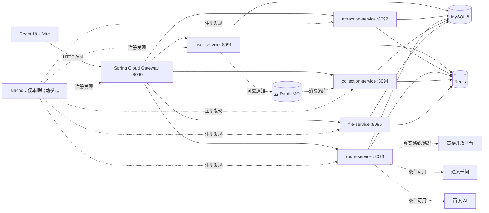

# 智慧旅游工程化展示项目

[English](README_EN.md) | 中文

面向**秋招答辩、企业与学校技术交流**的全栈项目，重点展示 Spring Boot 微服务、JWT 鉴权、HTTP 幂等、并发一致性、高德真实交通、RabbitMQ 可靠通知和 JMeter 可复现压测。它不是已经商业化运营的旅游平台，因此文档会明确区分已验证能力、外部条件能力和未实现能力。

[](https://github.com/888newstep/travel-website/actions/workflows/ci.yml)
[](https://adoptium.net/)
[](https://spring.io/projects/spring-boot)
[](https://react.dev/)
[](LICENSE)

> **范围约束**：不使用 Milvus；不加入短信计费、余额或账单；交通数据只接受项目配置的高德 API 结果；RabbitMQ 使用云端实例，Win11 本机运行 MySQL、Redis 和 JMeter。

## 当前验收快照

| 项目 | 结果 |
|------|------|
| 后端全量测试 | 245 tests，0 failure，0 error，3 skipped |
| 路线收藏同键幂等 | 100 并发仅 1 次业务执行，99 个处理中 409，最终 1 条记录 |
| 景点点评 UPSERT | 100 并发全部 HTTP 200，最终同一点评 ID、1 条记录 |
| 路线评论点赞 | 100 用户并发，最终点赞数和行为记录数均为 100 |
| 路线优化 | 100 个不同幂等键全部 HTTP 200，仅 1 次真实变更，历史 1 条 |
| Redis 故障 | 幂等写请求 fail-closed 返回 HTTP 503，数据库不新增重复记录 |
| 高德真实外呼 | 代码与本地桩已验证；当前仍待配置真实 `AMAP_API_KEY` |
| 云 RabbitMQ | 拓扑与测试已就绪；当前仍待配置云 broker 凭据完成 L4 实测 |

完整数据和日志索引见 [验收证据索引](backend/docs/showcase/EVIDENCE_INDEX.md)。

## 架构总览



### 运行模块

| 模块 | 端口 | 主要职责 |
|------|------|----------|
| Gateway | 8090 | 路由、JWT 验签、可信用户头重建、入口限流配置 |
| User Service | 8091 | 注册、登录、Token、资料与密码 |
| Attraction Service | 8092 | 城市、景点、餐厅、点评和最新状态快照 |
| Route Service | 8093 | 路线、日程、优化、高德交通和条件 AI 接口 |
| Collection Service | 8094 | 收藏、评论、游记、分享、通知、反馈和统计 |
| File Service | 8095 | 文件、分类、标签和版本 |
| `common` | 非运行模块 | 实体、Mapper、安全、幂等、Redis、RabbitMQ 和第三方调用基础设施 |

### 两种部署模式

| 模式 | 服务发现 | MySQL/Redis | RabbitMQ | 适用场景 |
|------|----------|-------------|----------|----------|
| Win11 本地脚本 | 内置 Nacos | 本机服务 | 云端 | 当前开发、调试和 JMeter 验收 |
| Docker Compose | 关闭 Nacos，使用容器 DNS 静态路由 | Compose 容器 | 外部云 broker | 一体化容器展示 |

Compose **不包含 Nacos，也不启动本地 RabbitMQ**。

## 核心工程设计

### 1. 认证与授权

- Gateway 移除客户端伪造的 `X-User-*` 请求头，校验 JWT 后重新注入可信身份。
- 每个业务服务再次解析 Bearer Token、检查 Redis 黑名单并建立 Spring Security 上下文。
- 路线、收藏、评论、文件和用户资料写操作执行角色或对象所有权校验。
- `JWT_SECRET` 为空或不足 32 字节时 Gateway 拒绝启动。

### 2. HTTP 幂等

- 已认证写请求支持 `Idempotency-Key`，前端 Axios 拦截器自动生成并在重试时复用。
- Redis Lua 原子维护 `PROCESSING` / `COMPLETED` 状态，并缓存首次状态码和响应体。
- 同键不同请求返回 409，处理中返回 409，完成请求返回原响应并附带 `Idempotency-Replayed: true`。
- Redis 不可用时返回 503 且不执行写库；关键业务再由 MySQL 唯一键兜底。

### 3. 路线优化一致性

- 同一路线先获取 Redisson 分布式锁，再在事务中使用 `SELECT ... FOR UPDATE` 锁定完整日程。
- 换位先把旧 `visit_order` 写成 `-id`，再批量写回 1..N，避免临时唯一键冲突。
- `uk_route_day_visit_order(route_id, day_number, visit_order)` 保证同一天位置唯一。
- 无变化请求不重复更新、不重复写历史；优化历史在事务提交后写 Redis，缓存失败不回滚 MySQL。
- 当前 `/route-optimization/apply` 使用显式完整顺序或按天最近邻排序；仓库中的 `GeneticAlgorithmTSP` 属于算法实验，不包装成当前入口的线上最优解。

### 4. RabbitMQ 可靠通知

- publisher confirm、mandatory returned、手动 ACK、5/30/120 秒 TTL 重试队列和 DLQ。
- Redis 消费状态机做快速幂等，`notification.source_message_id` 唯一键做最终兜底。
- 重试或死信消息只有获得 broker confirm 且未 returned 后，消费者才 ACK 原消息。
- 消息状态表支持状态记录和补偿抢占原语；当前尚无自动定时补偿扫描任务，不宣称完整 Outbox 自动重投。

### 5. 真实数据原则

- 路线距离、时长和拥堵来自高德驾车 API 的真实响应；失败时返回 `dataAvailable=false`。
- 没有历史客流明细时，历史平均和趋势接口明确不可用，不生成随机曲线。
- 没有可信价格或安全数据时，预算、安全评分和高级攻略接口明确不可用。
- 大模型输出只作为辅助文本，不作为交通、价格、开放时间或安全事实。

四条完整时序图见 [核心链路时序图](backend/docs/showcase/ARCHITECTURE_SEQUENCE_DIAGRAMS.md)。

## 能力边界

### 已验证并适合主演示

- JWT 登录、角色与对象所有权校验。
- 景点/城市/餐厅查询、景点点评原子 UPSERT。
- 路线 CRUD、收藏、评论、分享和路线优化一致性。
- HTTP 幂等响应复用、Redis 故障 fail-closed、数据库唯一键兜底。
- RabbitMQ 可靠消费代码与本地测试、JMeter 并发验证资产。

### 需要外部条件

- 高德路线与路况：需要真实 `AMAP_API_KEY`。
- 云 RabbitMQ：需要 broker 地址和凭据，并显式开启可靠通知开关。
- 通义千问文本能力：需要 `QWEN_API_KEY`。
- 百度 URL 图像识别：需要 `BAIDU_*` 和远程图片域名白名单。

### 不可用、遗留或不在范围

- 高级攻略、预算、安全评分和无数据源个性化推荐不作为完成能力。
- 上传图片综合分析、相似景点和多模态推荐/搜索仍有遗留占位实现，已从演示主线排除。
- 不建设 Milvus/RAG、短信计费、订单支付、酒店门票库存和历史客流预测。

逐项状态、降级行为和展示红线见 [项目能力边界](backend/docs/showcase/CAPABILITY_BOUNDARIES.md)。

## 快速开始

### 前置条件

- JDK 17、Maven 3.8+、Node.js 18+
- MySQL 8、Redis 6+
- Windows 本地模式需要项目内置 Nacos
- Docker Compose 模式需要 Docker Desktop，并准备云 RabbitMQ 连接参数

### 方式一：Win11 本地模式（当前推荐）

在当前 PowerShell 会话设置数据库、Redis、JWT 和可选外部服务环境变量。`deploy/.env` 只供 Compose 使用，`start-all.bat` 不会自动读取它。

```powershell
$env:JWT_SECRET = '<至少 32 字节的本地密钥>'
$env:DB_HOST = '127.0.0.1'
$env:DB_PORT = '3306'
$env:DB_NAME = 'travel_website'
$env:DB_USERNAME = 'root'
$env:DB_PASSWORD = '<本机 MySQL 密码>'
$env:REDIS_HOST = '127.0.0.1'
$env:REDIS_PORT = '6379'
$env:REDIS_PASSWORD = '<本机 Redis 密码>'

.\start-all.bat
npm --prefix frontend install
npm --prefix frontend run dev
```

- 前端：`http://localhost:3000`
- Gateway：`http://localhost:8090`
- Nacos：`http://localhost:8848/nacos`

详细排障步骤见 [STARTUP_GUIDE.md](STARTUP_GUIDE.md)。

### 方式二：Docker Compose

```powershell
Copy-Item deploy\.env.example deploy\.env
# 编辑 deploy/.env，至少修改密码、JWT_SECRET 和云 RabbitMQ 连接参数
docker compose --env-file deploy/.env -f deploy/docker-compose.yml up --build -d
```

- Web：`http://localhost:8080`
- Gateway：`http://localhost:8090`
- Compose 会启动 MySQL、Redis、5 个业务服务、Gateway 和 Web。
- Compose 关闭 Nacos/Sentinel/Seata，并通过容器 DNS 使用静态 Gateway 路由。
- `RABBITMQ_HOST`、账号和密码必须指向外部 broker；可靠通知功能开关默认仍为 `false`。

## 关键环境变量

| 变量 | 用途 | 默认/要求 |
|------|------|-----------|
| `JWT_SECRET` | JWT 签名 | 必填，至少 32 字节 |
| `DB_*` | MySQL | 本地默认 `127.0.0.1:3306/travel_website` |
| `REDIS_*` | Redis、锁、缓存、幂等 | 本地默认 `127.0.0.1:6379` |
| `RABBITMQ_*` | 云 RabbitMQ | 外部验收时必填 |
| `MQ_RELIABLE_NOTIFICATION_*_ENABLED` | 拓扑、生产者、消费者开关 | 默认 `false` |
| `MQ_STATUS_PERSISTENCE_ENABLED` | 消息状态表 | 默认 `false` |
| `AMAP_API_KEY` | 高德 Web 服务 | 真实交通必填 |
| `QWEN_API_KEY` | 通义千问 | 文本 AI 可选 |
| `BAIDU_*` | 百度 AI | 图像识别可选 |
| `CAPTCHA_DEMO_MODE` | 本地验证码展示 | 默认 `false`，公开环境禁止开启 |

模板见 [deploy/.env.example](deploy/.env.example)。

## API 示例

统一入口为 `http://localhost:8090/api/**`，响应使用 `Result<T>`。

```powershell
$baseUrl = 'http://127.0.0.1:8090/api'

# 公开景点查询
Invoke-RestMethod "$baseUrl/attractions"

# 登录
$login = Invoke-RestMethod -Method Post `
  -Uri "$baseUrl/users/login" `
  -ContentType 'application/json' `
  -Body (@{ username = '<账号>'; password = '<密码>' } | ConvertTo-Json)

$headers = @{ Authorization = "Bearer $($login.data.token)" }
Invoke-RestMethod -Headers $headers "$baseUrl/routes/my"
```

幂等重放、路线优化、高德和 RabbitMQ 的完整演示命令见 [五分钟演示脚本](backend/docs/showcase/DEMO_SCRIPT_5_MINUTES.md)。

## 验证与压测

```powershell
# 后端全量测试
.\mvnw.cmd -q -f backend\pom.xml clean test

# 前端静态检查与构建
npm --prefix frontend run lint
npm --prefix frontend run build

# 100 并发场景
.\ops\jmeter\run-idempotency-test.ps1 -Threads 100
.\ops\jmeter\run-attraction-review-upsert-test.ps1 -Threads 100
.\ops\jmeter\run-route-comment-like-test.ps1 -Threads 100
.\ops\jmeter\run-route-optimization-test.ps1 -Threads 100
```

JMeter 使用和指标解释见 [JMETER_IDEMPOTENCY_TEST.md](backend/docs/performance/JMETER_IDEMPOTENCY_TEST.md)。

## 项目结构

```text
travel/
├── backend/                 # Maven 多模块后端
│   ├── common/
│   ├── gateway/
│   ├── user-service/
│   ├── attraction-service/
│   ├── route-service/
│   ├── collection-service/
│   ├── file-service/
│   └── docs/
├── frontend/                # React 19 + TypeScript + Vite
├── deploy/                  # Docker Compose、Dockerfile、Nginx、环境变量模板
├── ops/                     # JMeter、高德、RabbitMQ 与运维脚本
├── run-logs/                # 本地验收证据（运行时生成）
├── start-all.bat
└── STARTUP_GUIDE.md
```

## 展示文档

- [核心链路时序图](backend/docs/showcase/ARCHITECTURE_SEQUENCE_DIAGRAMS.md)
- [项目能力边界](backend/docs/showcase/CAPABILITY_BOUNDARIES.md)
- [五分钟演示脚本](backend/docs/showcase/DEMO_SCRIPT_5_MINUTES.md)
- [验收证据索引](backend/docs/showcase/EVIDENCE_INDEX.md)
- [业务与工程治理计划](backend/docs/PROJECT_HARDENING_PLAN.md)
- [RabbitMQ 云端配置](backend/docs/infrastructure/RABBITMQ_CLOUD_CONFIGURATION.md)
- [后端说明](backend/README.md)
- [前端说明](frontend/README.md)

## 面试价值

- **幂等性**：为什么要同时使用入口状态机、业务锁和数据库唯一键。
- **并发一致性**：分布式锁、行锁、事务边界和唯一约束如何协作。
- **消息可靠性**：confirm、returned、manual ACK、TTL 重试、DLQ 与消费幂等。
- **外部依赖治理**：超时、响应体上限、并发舱壁、Key 脱敏和明确降级。
- **数据可信度**：没有数据源时为何返回不可用，而不是生成漂亮但不可验证的数据。
- **工程验证**：单元测试、真实服务集成、JMeter 指标和数据库最终状态如何形成证据链。

## License

[Apache License 2.0](LICENSE)
