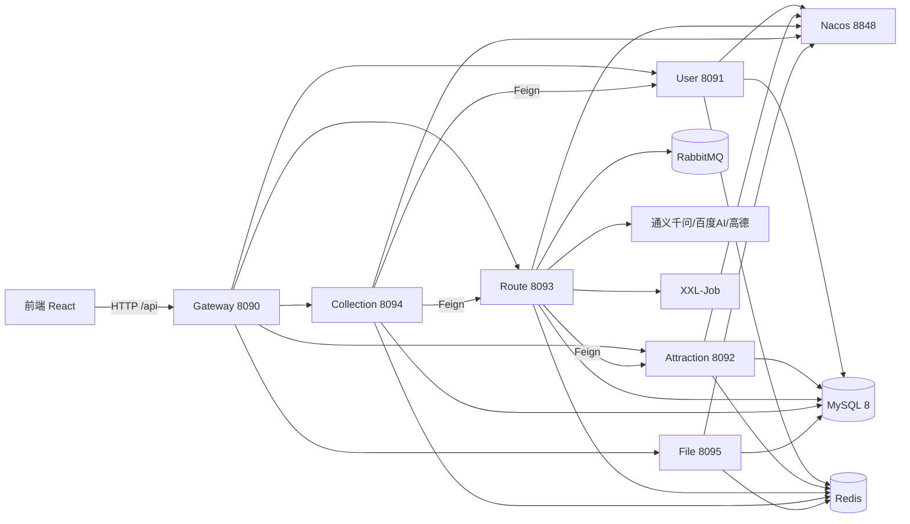

# 智慧旅游系统 (Smart Travel System)

[English](README_EN.md) | 中文

基于 Spring Cloud Alibaba 微服务架构 + React 构建的**企业级智慧旅游平台**，覆盖「AI 智能出行助手 → 路线规划 → 实时数据 → 用户社区」完整链路：6 大微服务 + 智能遗传算法路径优化 + 多模态 AI 能力 + 可靠消息投递，开箱即用的 Docker Compose 一键部署。

[](https://github.com/888newstep/travel-website/actions/workflows/ci.yml)
[](https://adoptium.net/)
[](https://spring.io/projects/spring-boot)
[](https://github.com/alibaba/spring-cloud-alibaba)
[](https://react.dev/)
[](LICENSE)

An enterprise-grade **Smart Travel Platform** built on **Spring Cloud Alibaba microservices + React**, featuring a genetic-algorithm TSP route optimizer, a multimodal AI agent matrix (Qwen / Baidu AI / AMap), and production-grade reliable messaging (RabbitMQ + outbox + idempotent retry) — with one-command Docker Compose deployment.

## 为什么选择智慧旅游系统？

与普通的 CRUD Demo、单体旅游网站相比，这个项目的独特组合是 **微服务 + AI 智能体 + 算法工程 + 可靠消息**：

| 对比对象 | 差异化优势 |
|---------|-----------|
| 普通单体 / CRUD Demo | Spring Cloud Alibaba 微服务架构、开放 Feign 服务编排、Nacos 注册配置中心 |
| 普通旅游网站 | TSP 遗传算法路径优化 + AI 个性化行程生成 + 实时人流状态联动 |
| 常见 AI Chat 应用 | 多模态（文本/图像）问答、智能行程、预算估算、图像识别闭环的 AI 能力矩阵 |
| 简单消息队列接入 | 可靠消息投递（消息表 + 定时重投 + Redis 幂等）与 RabbitMQ 生产级配置 |

> **🎯 适用人群**
> - 正在准备大厂 Java / AI 岗位面试的求职者（覆盖微服务、算法、消息队列高频考点）
> - 需要可落地旅游/出行平台原型的中小企业或独立开发者
> - 想学习 Spring Cloud Alibaba 微服务 + AI 集成完整实践的技术爱好者
> - 需要前后端分离 + Docker 一键部署样板的产品开发者

---

## 架构总览

```
                    ┌──────────────────────────────────────────────┐
                    │                前端 React 19                  │
                    │           (React Router + Vite + Tailwind)    │
                    └──────────────────────┬───────────────────────┘
                                   HTTP /api (Vite Proxy)
                    ┌──────────────────────▼───────────────────────┐
                    │        Gateway  (端口 8090, Spring Cloud      │
                    │        Gateway + Sentinel + JWT 鉴权)           │
                    └──────────────────────┬───────────────────────┘
        ┌───────────────┬──────────────────┼───────────────────┬───────────────┐
        ▼               ▼                  ▼                   ▼               ▼
 ┌─────────────┐ ┌─────────────┐ ┌──────────────────┐ ┌──────────────┐ ┌─────────────┐
 │ User Service│ │ Attraction  │ │   Route Service  │ │  Collection  │ │ File Service│
 │ (8091)      │ │ (8092)      │ │   (8093)         │ │  (8094)      │ │ (8095)      │
 │ 登录/JWT    │ │ 景点/城市   │ │ 路线/TSP遗传算法 │ │ 游记/评论    │ │ 文件/标签   │
 │             │ │ 美食/实时   │ │ AI智能体/多模态  │ │ 收藏/分享    │ │ 资源管理    │
 └──────┬──────┘ └────┬────────┘ └────────┬─────────┘ └──────┬───────┘ └──────┬──────┘
        │             │                   │                  │                │
        └─────────────┴───────┐           │                  │                │
                              ▼           ▼                                    │
                    ┌──────────────────────┐        ┌──────────────────────────┘
                    │  Nacos 注册/配置中心   │        │
                    │ (8848)             │        │
                    └──────────────────────┘        │
        ┌───────────────────────────────────────────▼──────────────────────────┐
        │   基础设施层: MySQL 8 · Redis(Redisson分布式锁/缓存/限流)              │
        │   · RabbitMQ(可靠消息投递) · XXL-Job(定时任务) · 高德地图/百度AI/通义千问  │
        └───────────────────────────────────────────────────────────────────────┘
```

**核心链路**：用户请求经 **Gateway（Sentinel 限流 + JWT 鉴权）** 路由到各微服务 → Route Service 基于高德地图数据与 **遗传算法 TSP** 生成/优化路线，或由 **AI 智能体**（通义千问）完成对话、行程生成、图片识别与预算估算 → 数据通过 MyBatis-Plus 落库 MySQL，热点经 Redis 缓存、跨服务调用经 Redisson 分布式锁与 RabbitMQ **可靠消息**解耦。

### 架构图（Mermaid）



---

## 功能特性

- **微服务架构** — 6 大服务按业务域拆分（user / attraction / route / collection / file / gateway），Nacos 注册与配置中心
- **AI 智能体矩阵** — 智能对话、行程生成、智能客服问答、景点智能介绍、个性化推荐、预算估算、旅行攻略生成（通义千问）
- **多模态 AI** — 文本 + 图像联合问答与搜索，百度 AI 图像识别（类型/标签/描述/相似景点）
- **路线规划与优化** — `RoutePlanAlgorithm` 混合规划 + **遗传算法 TSP**（种群 100 / 200 代收敛），支持距离/时间/成本/均衡多目标优化，AI 约束注入（偏好 + 时间窗）
- **实时数据** — 景点实时状态、人流监控与预警
- **用户社区** — 游记分享、路线收藏/分享/评论、积分统计、点赞通知
- **可靠消息投递** — RabbitMQ 消息表 + 定时重投 + Redis 幂等，防丢失、防重复
- **安全与治理** — Spring Security + JWT 网关鉴权、Sentinel 限流熔断、Redis 限流、Druid 监控、统一异常与 `Result<T>` 响应
- **资源文件管理** — 文件上传/标签/多格式支持，`file-service` 独立服务
- **一键部署** — Docker Compose 编排 MySQL + Redis + RabbitMQ + 6 微服务 + Nginx 前端，`start-all.bat` 本机一键启动

---

## 技术栈

全栈概览（后端完整技术栈详见 [backend/README.md](backend/README.md)，前端详见 [frontend/README.md](frontend/README.md)）：

| 层级 | 技术 |
|------|------|
| 后端 | Spring Boot 3.3.5 · Spring Cloud 2023.0.3 · Spring Cloud Alibaba 2023.0.3.2 · Java 17 · MyBatis-Plus 3.5.8 · Druid 1.2.23 |
| 前端 | React 19 · TypeScript · Vite 6 · React Router 7 · Axios · Tailwind CSS 4 |
| 基础设施 | MySQL 8.0 · Redis（Redisson 3.37）· RabbitMQ（可靠消息投递）· Nacos · XXL-Job 2.4.1 |
| AI | DashScope（通义千问）2.14 · 百度 AI SDK · 高德地图 · OkHttp |
| 安全与治理 | Spring Security + JWT（jjwt 0.12.5）· Sentinel · Knife4j 4.5 / OpenAPI 3.0 |
| 算法 | JTS 1.19 几何计算 · 自研遗传算法 TSP |
| 部署 | Docker · Docker Compose · Nginx |

---

## 快速开始

> 详细的启动步骤见 [STARTUP_GUIDE.md](STARTUP_GUIDE.md)。本项目主要面向 **Windows 本机 + Linux 虚拟机生产** 双轨部署。

### 前置条件

- JDK 17+、Maven 3.8+
- MySQL 8.0（端口 3306）、Redis（端口 6379）
- Node.js 18+（前端，可选）
- Docker & Docker Compose（可选，用于一键容器化部署）

### 方式一：一键启动（Windows）

```powershell
# 1. 配置数据库密码等环境变量
Copy-Item deploy\.env.example deploy\.env

# 2. 一键启动（自动拉起 Nacos、编译并启动 6 个微服务）
.\start-all.bat
```

### 方式二：手动启动

```bash
# 1. 启动 Nacos（地址 http://localhost:8848/nacos，默认 nacos/nacos）
cd backend/nacos/nacos
bin/startup.cmd -m standalone

# 2. 编译后端
cd backend
mvn clean package -DskipTests

# 3. 依次启动 6 个微服务（命令与端口详见 backend/README.md「启动服务」）

# 4. 启动前端（可选，或使用 Nginx 托管 dist）
cd frontend
npm install
npm run dev                                                       # http://localhost:3000
```

### 方式三：Docker Compose 一键部署

```bash
Copy-Item deploy\.env.example deploy\.env
docker compose -f deploy/docker-compose.yml up --build -d
```

一键拉起 **MySQL + Redis + RabbitMQ + 全部微服务 + Nginx 前端**，含健康检查与依赖编排。访问 `http://localhost:8080`；API 经网关 `http://localhost:8090`。

### 环境变量

复制 `deploy/.env.example` 为 `deploy/.env` 并填写：`DB_PASSWORD`、`REDIS_PASSWORD`、`RABBITMQ_*`、`JWT_SECRET`、`DRUID_*`；AI 相关密钥（`AMAP_API_KEY`、`BAIDU_*`、`QWEN_API_KEY`）按需填写，不填则对应能力降级。

---

## API 使用示例

统一响应结构：`{ "code": 200, "message": "操作成功", "data": {...}, "timestamp": 1704067200000, "success": true }`。

所有请求经网关 `http://localhost:8090/api/**`。完整接口表见 [backend/README.md](backend/README.md#主要-api)，以下为代表性调用示例：

### 用户登录

```bash
curl -X POST http://localhost:8090/api/users/login \
  -H "Content-Type: application/json" \
  -d '{"username":"admin","password":"123456"}'
# 返回 token，后续请求携带 Authorization: Bearer <token>
```

### AI 智能对话

```bash
curl -X POST http://localhost:8090/api/ai/chat \
  -H "Content-Type: application/json" \
  -d '{"message":"推荐杭州 3 天 2 晚的亲子游路线"}'
```

### AI 行程生成

```bash
curl -X POST http://localhost:8090/api/ai/itinerary/generate \
  -H "Content-Type: application/json" \
  -d '{"destination":"杭州","days":3,"preferences":{"theme":"亲子","budget":"经济"}}'
```

### 智能路线规划（约束 + 偏好）

```bash
curl -X POST http://localhost:8090/api/ai/advanced/plan \
  -H "Content-Type: application/json" \
  -d '{"preferences":{"startCityId":1,"days":3,"theme":"自然风光"},"constraints":{"maxTravelTimePerDay":6,"preferedStartTime":"09:00"}}'
```

### 图像分析（多模态）

```bash
curl -X POST http://localhost:8090/api/ai/image-analysis \
  -H "Content-Type: application/json" \
  -d '{"imageUrl":"https://example.com/photo.jpg","analysisType":"attraction-recognition"}'
```

### 路线优化（遗传算法）

```bash
curl -X GET "http://localhost:8090/api/routes/smart/list?cityId=1&optimizationType=distance&limit=5"
```

### 文件上传

```bash
curl -X POST -F "file=@guide.pdf" http://localhost:8090/api/file/upload
```

---

## 项目结构

```
travel/
├── backend/            # Spring Cloud 多模块后端（common / gateway / user-service / attraction-service /
│                       #   route-service / collection-service / file-service）
│                       #   ※ 技术栈、模块结构、启动与 API 详见 backend/README.md
├── frontend/           # React 19 + Vite + TypeScript（详见 frontend/README.md）
├── deploy/             # Docker Compose / Dockerfile / Nginx / 环境变量模板
├── docs/               # 实习指南、数据库实验报告
├── ops/scripts/        # 运维脚本（健康检查等）
├── scripts/            # 开发脚本（API smoke 测试）
├── start-all.bat / stop-all.bat   # Windows 一键启动/停止
└── STARTUP_GUIDE.md    # 详细启动指南
```

---

## 服务端口一览

| 服务 | 端口 | 说明 |
|------|------|------|
| Gateway | 8090 | API 网关（鉴权 + 限流） |
| User Service | 8091 | 用户与认证 |
| Attraction Service | 8092 | 景点/城市/美食/实时 |
| Route Service | 8093 | 路线/算法/AI 智能体 |
| Collection Service | 8094 | 社区/收藏/评论/通知 |
| File Service | 8095 | 文件管理 |
| Nacos | 8848 | 注册与配置中心 |
| MySQL | 3306 | 数据库 |
| Redis | 6379 | 缓存/锁/限流 |
| RabbitMQ | 5672 / 15672 | 可靠消息 |
| Frontend | 3000 | 前端开发服务器 |
| Nginx(容器) | 8080 | 前端生产托管 |

---

## 面试价值

该项目适用于以下面试场景：

### Java 后端岗

| 知识点 | 项目体现 |
|--------|---------|
| 微服务架构 | Spring Cloud Alibaba 全套、按业务域拆分 6 服务、OpenFeign 服务编排 |
| 网关 | Gateway 路由、JWT 全局鉴权、Sentinel 限流熔断 |
| 消息队列 | RabbitMQ 可靠投递：消息表 + 定时重投 + Redis 幂等 |
| 分布式锁 | Redisson 分布式锁、缓存一致性 |
| 数据库优化 | 20 表设计、Druid 连接池、索引与逻辑删除规范 |
| 安全 | Spring Security + JWT、接口鉴权 |

### AI 应用岗

| 知识点 | 项目体现 |
|--------|---------|
| AI Agent 集成 | DashScope 通义千问对话/行程/攻略/预算估算 |
| 多模态 | 文本 + 图像联合问答、百度 AI 图像识别 |
| 智能推荐 | 个性化推荐、相似景点、实时调整 |
| 路径算法 | 遗传算法 TSP、多目标优化（距离/时间/成本） |

---

## Contributors

Thanks to the people who have contributed to this project:

<a href="https://github.com/888newstep">
  
</a>

> Want to contribute? See [CONTRIBUTING.md](CONTRIBUTING.md). All contributions are welcome!

---

## License

[Apache License 2.0](LICENSE)