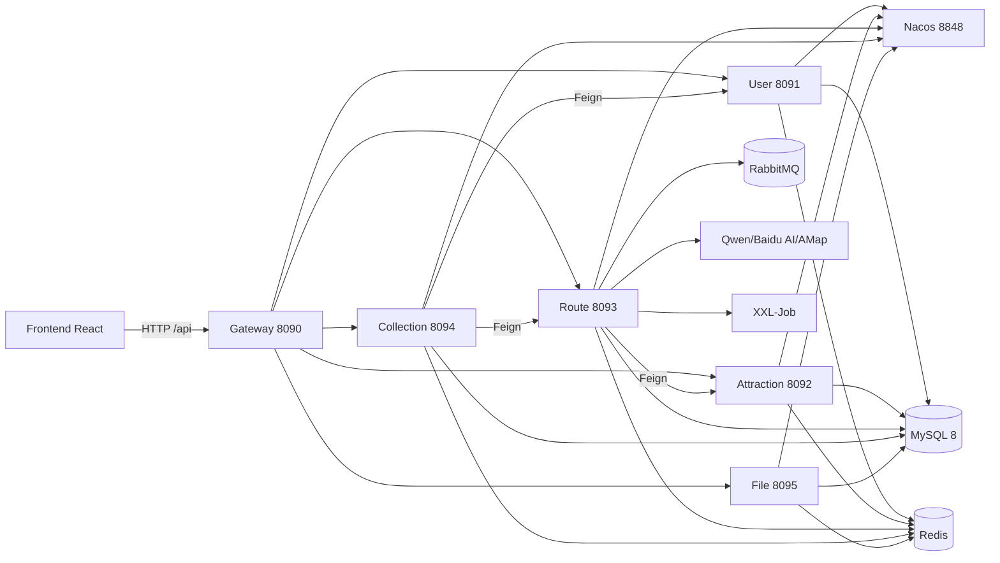

# Smart Travel System

English | [中文](README.md)

Built on Spring Cloud Alibaba microservices + React, this **enterprise-grade smart travel platform** covers the full chain of *AI travel assistant → route planning → real-time data → user community*: 6 microservices + genetic-algorithm route optimization + multimodal AI + reliable messaging, with out-of-the-box Docker Compose deployment.

[](https://github.com/888newstep/travel-website/actions/workflows/ci.yml)
[](https://adoptium.net/)
[](https://spring.io/projects/spring-boot)
[](https://github.com/alibaba/spring-cloud-alibaba)
[](https://react.dev/)
[](LICENSE)

An enterprise-grade **Smart Travel Platform** built on **Spring Cloud Alibaba microservices + React**, featuring a genetic-algorithm TSP route optimizer, a multimodal AI agent matrix (Qwen / Baidu AI / AMap), and production-grade reliable messaging (RabbitMQ + outbox + idempotent retry) — with one-command Docker Compose deployment.

## Why Smart Travel System?

Compared with plain CRUD demos, monolithic travel sites, and common AI chat apps, this project's unique combination is **microservices + AI agents + algorithm engineering + reliable messaging**:

| Compared with | Differentiated advantage |
|---------------|--------------------------|
| Plain monolith / CRUD demo | Spring Cloud Alibaba microservices, OpenFeign orchestration, Nacos registry & config center |
| Ordinary travel website | TSP genetic-algorithm route optimization + AI personalized itinerary + real-time crowd status |
| Common AI chat app | Multimodal (text/image) Q&A, smart itinerary, budget estimation, image-recognition closed-loop AI matrix |
| Simple MQ integration | Reliable messaging (outbox + scheduled retry + Redis idempotency) and production-grade RabbitMQ config |

> **🎯 Target audience**
> - Job seekers preparing for big-tech Java / AI interviews (covers high-frequency topics: microservices, algorithms, message queues)
> - SMBs or indie developers needing a deployable travel / mobility platform prototype
> - Tech enthusiasts wanting to learn Spring Cloud Alibaba microservices + AI integration end-to-end
> - Product developers needing a frontend-backend separated + Docker one-click deployment template

---

## Architecture Overview

```
                    ┌──────────────────────────────────────────────┐
                    │              Frontend React 19               │
                    │         (React Router + Vite + Tailwind)     │
                    └──────────────────────┬───────────────────────┘
                                   HTTP /api (Vite Proxy)
                    ┌──────────────────────▼───────────────────────┐
                    │   Gateway (port 8090, Spring Cloud Gateway    │
                    │   + Sentinel + JWT auth)                      │
                    └──────────────────────┬───────────────────────┘
        ┌───────────────┬──────────────────┼───────────────────┬───────────────┐
        ▼               ▼                  ▼                   ▼               ▼
 ┌─────────────┐ ┌─────────────┐ ┌──────────────────┐ ┌──────────────┐ ┌─────────────┐
 │ User Service│ │ Attraction  │ │   Route Service  │ │  Collection  │ │ File Service│
 │ (8091)      │ │ (8092)      │ │   (8093)         │ │  (8094)      │ │ (8095)      │
 │ Login/JWT   │ │ Attractions │ │ Routes/TSP-GA    │ │ Travelogues  │ │ Files/Tags  │
 │             │ │ Cities/Food │ │ AI Agent/Multi-M │ │ Fav/Share    │ │ Resources   │
 └──────┬──────┘ └────┬────────┘ └────────┬─────────┘ └──────┬───────┘ └──────┬──────┘
        │             │                   │                  │                │
        └─────────────┴───────┐           │                  │                │
                              ▼           ▼                                    │
                    ┌──────────────────────┐        ┌──────────────────────────┘
                    │  Nacos registry/config │        │
                    │ (8848)               │        │
                    └──────────────────────┘        │
        ┌───────────────────────────────────────────▼──────────────────────────┐
        │  Infrastructure: MySQL 8 · Redis (Redisson distributed lock/cache/    │
        │  rate limiting) · RabbitMQ (reliable messaging) · XXL-Job (scheduled │
        │  tasks) · AMap / Baidu AI / Qwen                                     │
        └───────────────────────────────────────────────────────────────────────┘
```

**Core flow**: User requests go through the **Gateway (Sentinel rate limiting + JWT auth)** to each microservice → the Route Service uses AMap data and the **genetic-algorithm TSP** to generate/optimize routes, or the **AI agent** (Qwen) handles conversation, itinerary generation, image recognition, and budget estimation → data persists to MySQL via MyBatis-Plus, hot data is cached in Redis, and cross-service calls are decoupled via Redisson distributed locks and RabbitMQ **reliable messaging**.

### Architecture Diagram (Mermaid)



---

## Features

- **Microservice architecture** — 6 services split by business domain (user / attraction / route / collection / file / gateway), Nacos registry & config center
- **AI agent matrix** — smart dialog, itinerary generation, smart Q&A, attraction intros, personalized recommendations, budget estimation, travel guide generation (Qwen)
- **Multimodal AI** — text + image joint Q&A and search, Baidu AI image recognition (type / tag / description / similar attractions)
- **Route planning & optimization** — `RoutePlanAlgorithm` hybrid planning + **genetic-algorithm TSP** (population 100 / 200 generations convergence), multi-objective optimization (distance / time / cost / balance), AI constraint injection (preferences + time windows)
- **Real-time data** — attraction real-time status, crowd monitoring and alerts
- **User community** — travelogues, route collection / share / comment, points, like notifications
- **Reliable messaging** — RabbitMQ outbox + scheduled retry + Redis idempotency, loss-proof and duplicate-proof
- **Security & governance** — Spring Security + JWT gateway auth, Sentinel rate limiting / circuit breaking, Redis rate limiting, Druid monitoring, unified exceptions and `Result<T>` response
- **Resource & file management** — file upload / tagging / multi-format support, independent `file-service`
- **One-click deployment** — Docker Compose orchestrates MySQL + Redis + RabbitMQ + 6 microservices + Nginx frontend; `start-all.bat` for local one-click start

---

## Tech Stack

| Layer | Technology |
|-------|------------|
| Backend framework | Spring Boot 3.3.5, Spring Cloud 2023.0.3, Spring Cloud Alibaba 2023.0.3.2 |
| Language | Java 17 |
| Service governance | Nacos, Spring Cloud Gateway, OpenFeign, LoadBalancer |
| Data layer | MySQL 8.0, MyBatis-Plus 3.5.8, Druid connection pool |
| Cache & lock | Redis, Redisson 3.37, Spring Data Redis |
| Messaging | RabbitMQ (reliable delivery + scheduled retry + Redis idempotency) |
| AI | DashScope (Qwen) 2.14, Baidu AI SDK, OkHttp |
| Algorithms | JTS 1.19 geometry, in-house genetic-algorithm TSP |
| Task scheduling | XXL-Job 2.4.1 |
| Rate limiting & resilience | Sentinel, custom RateLimiter |
| Frontend | React 19, TypeScript, Vite 6, React Router 7, Axios, Tailwind CSS 4 |
| API docs | Knife4j 4.5 / OpenAPI 3.0 |
| Deployment | Docker, Docker Compose, Nginx |

---

## Quick Start

> See [STARTUP_GUIDE.md](STARTUP_GUIDE.md) for detailed steps. This project targets a **Windows local + Linux VM production** dual-track deployment.

### Prerequisites

- JDK 17+, Maven 3.8+
- MySQL 8.0 (port 3306), Redis (port 6379)
- Node.js 18+ (frontend, optional)
- Docker & Docker Compose (optional, for containerized one-click deployment)

### Option 1: One-click start (Windows)

```powershell
# 1. Configure env vars such as the DB password
Copy-Item deploy\.env.example deploy\.env

# 2. One-click start (auto starts Nacos, builds and starts the 6 microservices)
.\start-all.bat
```

### Option 2: Manual start

```bash
# 1. Start Nacos (http://localhost:8848/nacos, default nacos/nacos)
cd backend/nacos/nacos
bin/startup.cmd -m standalone

# 2. Build and start the six microservices (one terminal each)
cd backend
mvn clean package -DskipTests
java -jar user-service/target/user-service-1.0-SNAPSHOT.jar        # 8091
java -jar attraction-service/target/attraction-service-1.0-SNAPSHOT.jar  # 8092
java -jar route-service/target/route-service-1.0-SNAPSHOT.jar      # 8093
java -jar collection-service/target/collection-service-1.0-SNAPSHOT.jar  # 8094
java -jar file-service/target/file-service-1.0-SNAPSHOT.jar        # 8095
java -jar gateway/target/gateway-1.0-SNAPSHOT.jar                  # 8090

# 3. Start frontend (optional, or use Nginx to serve dist)
cd frontend
npm install
npm run dev                                                       # http://localhost:3000
```

### Option 3: Docker Compose one-click

```bash
Copy-Item deploy\.env.example deploy\.env
docker compose -f deploy/docker-compose.yml up --build -d
```

Brings up **MySQL + Redis + RabbitMQ + all microservices + Nginx frontend**, with health checks and dependency orchestration. Visit `http://localhost:8080`; API via gateway `http://localhost:8090`.

### Environment Variables

Copy `deploy/.env.example` to `deploy/.env` and fill in: `DB_PASSWORD`, `REDIS_PASSWORD`, `RABBITMQ_*`, `JWT_SECRET`, `DRUID_*`; AI keys (`AMAP_API_KEY`, `BAIDU_*`, `QWEN_API_KEY`) as needed — if omitted, the corresponding capability degrades gracefully.

---

## API Examples

Unified response structure: `{ "code": 200, "message": "...", "data": {...}, "timestamp": 1704067200000, "success": true }`.

All requests go through the gateway `http://localhost:8090/api/**`.

### User login

```bash
curl -X POST http://localhost:8090/api/users/login \
  -H "Content-Type: application/json" \
  -d '{"username":"admin","password":"123456"}'
# Returns a token; subsequent requests carry Authorization: Bearer <token>
```

### AI chat

```bash
curl -X POST http://localhost:8090/api/ai/chat \
  -H "Content-Type: application/json" \
  -d '{"message":"Recommend a 3-day 2-night family trip route in Hangzhou"}'
```

### AI itinerary generation

```bash
curl -X POST http://localhost:8090/api/ai/itinerary/generate \
  -H "Content-Type: application/json" \
  -d '{"destination":"Hangzhou","days":3,"preferences":{"theme":"family","budget":"economy"}}'
```

### Smart route planning (constraints + preferences)

```bash
curl -X POST http://localhost:8090/api/ai/advanced/plan \
  -H "Content-Type: application/json" \
  -d '{"preferences":{"startCityId":1,"days":3,"theme":"nature"},"constraints":{"maxTravelTimePerDay":6,"preferedStartTime":"09:00"}}'
```

### Image analysis (multimodal)

```bash
curl -X POST http://localhost:8090/api/ai/image-analysis \
  -H "Content-Type: application/json" \
  -d '{"imageUrl":"https://example.com/photo.jpg","analysisType":"attraction-recognition"}'
```

### Route optimization (genetic algorithm)

```bash
curl -X GET "http://localhost:8090/api/routes/smart/list?cityId=1&optimizationType=distance&limit=5"
```

### File upload

```bash
curl -X POST -F "file=@guide.pdf" http://localhost:8090/api/file/upload
```

---

## Project Structure

```
travel/
├── backend/                        # Backend (Spring Cloud multi-module Maven project)
│   ├── common/                     # Common layer: entities / unified response / exceptions / infra config
│   │   └── src/main/java/travel/common/
│   │       ├── config/             # MyBatis-Plus / Redis / Redisson / RabbitMQ / Sentinel / Security config
│   │       ├── entity/             # Entities for 20+ database tables
│   │       ├── service/            # Distributed lock / message producer / reliable retry / Redis idempotency
│   │       ├── utils/              # JWT / rate limiting / AMap / cache / Result utilities
│   │       └── exception/          # Global exception handling and business exception hierarchy
│   ├── gateway/                    # Unified gateway: routing / auth / CORS / Sentinel rate limiting
│   ├── user-service/               # Users & authentication
│   ├── attraction-service/         # Attractions / cities / food / real-time status
│   ├── route-service/              # Routes / path algorithms / AI agents (core domain)
│   │   └── src/main/java/travel/route/
│   │       ├── algorithm/          # Genetic-algorithm TSP optimizer
│   │       ├── controller/         # Route / AI series controllers
│   │       ├── dto/ai/             # AI request/response models (itinerary / budget / guide / multimodal…)
│   │       ├── service/            # Smart route / optimization / real-time adjust / personalized recommendation
│   │       └── feign/              # Cross-service call clients
│   ├── collection-service/         # Travelogues / comments / favorites / shares / notifications / feedback
│   └── file-service/               # File upload & tag management
├── frontend/                       # Frontend (React 19 + Vite + TypeScript)
│   ├── src/api/                    # Domain-packaged API clients
│   ├── src/pages/                  # 16 pages: home / attractions / routes / AI chat / real-time / community…
│   ├── src/components/             # Common components & layout
│   ├── src/lib/                    # Request wrappers / auth (token storage)
│   └── scripts/                    # Local dev scripts
├── deploy/                         # Docker Compose / Dockerfile / Nginx / env templates
├── docs/                           # Internship guide, database experiment report
├── ops/scripts/                    # Ops scripts (health check, etc.)
├── scripts/                        # Dev scripts (API smoke test)
├── start-all.bat / stop-all.bat    # Windows one-click start / stop
└── STARTUP_GUIDE.md                # Detailed startup guide
```

---

## Service Ports

| Service | Port | Description |
|---------|------|-------------|
| Gateway | 8090 | API gateway (auth + rate limiting) |
| User Service | 8091 | Users & authentication |
| Attraction Service | 8092 | Attractions / cities / food / real-time |
| Route Service | 8093 | Routes / algorithms / AI agents |
| Collection Service | 8094 | Community / favorites / comments / notifications |
| File Service | 8095 | File management |
| Nacos | 8848 | Registry & config center |
| MySQL | 3306 | Database |
| Redis | 6379 | Cache / lock / rate limiting |
| RabbitMQ | 5672 / 15672 | Reliable messaging |
| Frontend | 3000 | Frontend dev server |
| Nginx (container) | 8080 | Frontend production hosting |

---

## Interview Value

This project applies to the following interview scenarios:

### Java Backend

| Topic | Project embodiment |
|-------|--------------------|
| Microservice architecture | Full Spring Cloud Alibaba stack, 6 services split by business domain, OpenFeign orchestration |
| Gateway | Gateway routing, JWT global auth, Sentinel rate limiting & circuit breaking |
| Message queue | RabbitMQ reliable delivery: outbox + scheduled retry + Redis idempotency |
| Distributed lock | Redisson distributed lock, cache consistency |
| Database optimization | 20-table design, Druid pool, index & logical-delete conventions |
| Security | Spring Security + JWT, API auth |

### AI Application

| Topic | Project embodiment |
|-------|--------------------|
| AI Agent integration | DashScope / Qwen: dialog / itinerary / guide / budget estimation |
| Multimodal | Text + image joint Q&A, Baidu AI image recognition |
| Smart recommendation | Personalized recommendation, similar attractions, real-time adjustment |
| Path algorithms | Genetic-algorithm TSP, multi-objective optimization (distance / time / cost) |

---

## Contributors

Thanks to the people who have contributed to this project:

<a href="https://github.com/888newstep">
  
</a>

> Want to contribute? See [CONTRIBUTING.md](CONTRIBUTING.md). All contributions are welcome!

---

## License

[Apache License 2.0](LICENSE)
