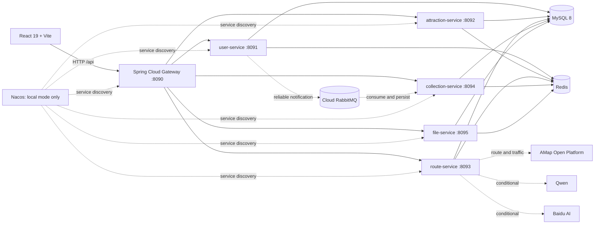

# Smart Travel Engineering Showcase

English | [中文](README.md)

A full-stack project for **graduate recruitment interviews and technical knowledge sharing in companies and schools**. It focuses on Spring Boot microservices, JWT security, HTTP idempotency, concurrent consistency, real AMap traffic data, reliable RabbitMQ notifications, and reproducible JMeter tests. It is not presented as an already commercialized travel platform, so verified, conditional, unavailable, and out-of-scope capabilities are documented separately.

[](https://github.com/888newstep/travel-website/actions/workflows/ci.yml)
[](https://adoptium.net/)
[](https://spring.io/projects/spring-boot)
[](https://react.dev/)
[](LICENSE)

> **Scope**: no Milvus; no SMS billing, balance, or invoice features; route traffic accepts only configured AMap API results; RabbitMQ is external/cloud-hosted, while MySQL, Redis, and JMeter run locally on Windows 11.

## Verification Snapshot

| Item | Result |
|------|--------|
| Backend test suite | 245 tests, 0 failures, 0 errors, 3 skipped |
| Route collection idempotency | 100 concurrent requests caused one business execution and one final row |
| Attraction review UPSERT | 100 successful responses converged to one review ID and one row |
| Route comment likes | 100 users produced 100 durable actions and a final like count of 100 |
| Route optimization | 100 distinct idempotency keys, one actual change, one history record |
| Redis outage | Idempotent writes failed closed with HTTP 503 and created no duplicate row |
| Real AMap call | Code and local HTTP stubs verified; a real `AMAP_API_KEY` is still required |
| Cloud RabbitMQ | Topology and tests are ready; live broker credentials are still required |

See the [evidence index](backend/docs/showcase/EVIDENCE_INDEX.md) for metrics, logs, and limitations.

## Architecture



### Runtime Services

| Module | Port | Responsibility |
|--------|------|----------------|
| Gateway | 8090 | Routing, JWT verification, trusted identity headers, entry governance |
| User Service | 8091 | Registration, login, tokens, profiles, passwords |
| Attraction Service | 8092 | Cities, attractions, restaurants, reviews, latest status snapshots |
| Route Service | 8093 | Routes, schedules, optimization, AMap traffic, conditional AI APIs |
| Collection Service | 8094 | Collections, comments, notes, sharing, notifications, feedback |
| File Service | 8095 | Files, categories, tags, versions |
| `common` | Library | Entities, mappers, security, idempotency, Redis, RabbitMQ, external clients |

### Deployment Modes

| Mode | Discovery | MySQL/Redis | RabbitMQ | Primary Use |
|------|-----------|-------------|----------|-------------|
| Windows local scripts | Bundled Nacos | Local services | Cloud broker | Development and JMeter verification |
| Docker Compose | Nacos disabled; static container DNS | Compose containers | External cloud broker | Containerized showcase |

Docker Compose starts neither Nacos nor a local RabbitMQ broker.

## Engineering Highlights

### Authentication and Authorization

- The Gateway removes spoofed `X-User-*` headers, validates JWTs, and injects trusted identity headers.
- Each servlet service parses the Bearer token again, checks the Redis logout blacklist, and builds the Spring Security context.
- Protected writes enforce roles or object ownership.
- The Gateway refuses to start when `JWT_SECRET` is blank or shorter than 32 UTF-8 bytes.

### HTTP Idempotency

- Authenticated writes may carry `Idempotency-Key`; the frontend creates one automatically and preserves it across retries.
- Redis Lua scripts atomically manage `PROCESSING` and `COMPLETED` states and store the first HTTP response.
- In-progress requests return 409, a reused key with a different request returns 409, and completed requests replay with `Idempotency-Replayed: true`.
- Redis failure returns 503 before business execution; endpoint-specific MySQL unique keys remain the final safety net.

### Concurrent Route Optimization

- A Redisson lock serializes the route across instances, while `SELECT ... FOR UPDATE` protects the complete schedule inside the transaction.
- Existing positions are first moved to `-id`, then rewritten to `1..N`, avoiding temporary unique-key conflicts during swaps.
- `uk_route_day_visit_order(route_id, day_number, visit_order)` enforces one position per route day.
- No-op requests do not update rows or append history; history is written to Redis only after commit.
- The current `/route-optimization/apply` path uses a complete explicit order or per-day nearest-neighbor ordering. `GeneticAlgorithmTSP` remains an algorithm experiment and is not claimed as this endpoint's production optimizer.

### Reliable RabbitMQ Notifications

- Publisher confirms, mandatory returns, manual ACK, 5/30/120-second TTL retry queues, and a DLQ.
- Redis provides the fast idempotency path; `notification.source_message_id` provides the database uniqueness fallback.
- The consumer ACKs the original only after a retry or dead-letter publish is confirmed and not returned.
- The message status table provides persistence and compensation-claim primitives, but there is currently no wired scheduled compensation scanner. This project does not claim a complete automatic Outbox republisher.

### Trusted Data Boundaries

- Route distance, duration, and congestion come from real AMap driving responses; failures return `dataAvailable=false`.
- Historical crowd endpoints return unavailable when no history table exists instead of generating random trends.
- Budget, safety score, and advanced guide endpoints return unavailable without trustworthy sources.
- LLM output is assistant text, not a source of truth for traffic, prices, opening hours, or safety.

See the [core sequence diagrams](backend/docs/showcase/ARCHITECTURE_SEQUENCE_DIAGRAMS.md) for the four end-to-end flows.

## Capability Boundaries

### Verified and Suitable for the Main Demo

- JWT login, roles, and object ownership checks.
- Attraction/city/restaurant queries and atomic attraction-review UPSERT.
- Route CRUD, collections, comments, sharing, and route optimization consistency.
- HTTP response replay, Redis fail-closed behavior, and database uniqueness fallbacks.
- Reliable-notification code, local tests, and reproducible JMeter assets.

### Requires External Configuration

- AMap route and traffic data requires a real `AMAP_API_KEY`.
- Cloud RabbitMQ requires broker credentials and explicit reliable-notification feature flags.
- Qwen text generation requires `QWEN_API_KEY`.
- Baidu URL image recognition requires `BAIDU_*` and an explicit remote-image host allowlist.

### Unavailable, Legacy, or Out of Scope

- Advanced guides, budgets, safety scores, and recommendations without a data source are not presented as completed features.
- Upload-based image analysis, similar-attraction results, and multimodal recommendation/search still contain legacy placeholders and are excluded from the demo.
- Milvus/RAG, SMS billing, payments, inventory, and historical crowd prediction are out of scope.

See the detailed [capability boundary matrix](backend/docs/showcase/CAPABILITY_BOUNDARIES.md).

## Quick Start

### Prerequisites

- JDK 17, Maven 3.8+, Node.js 18+
- MySQL 8 and Redis 6+
- Bundled Nacos for Windows local mode
- Docker Desktop and cloud RabbitMQ connection values for Compose mode

### Option 1: Windows Local Mode

Set database, Redis, JWT, and optional external-service variables in the current PowerShell session. `deploy/.env` is for Compose only; `start-all.bat` does not load it automatically.

```powershell
$env:JWT_SECRET = '<at least 32 bytes>'
$env:DB_HOST = '127.0.0.1'
$env:DB_PORT = '3306'
$env:DB_NAME = 'travel_website'
$env:DB_USERNAME = 'root'
$env:DB_PASSWORD = '<local MySQL password>'
$env:REDIS_HOST = '127.0.0.1'
$env:REDIS_PORT = '6379'
$env:REDIS_PASSWORD = '<local Redis password>'

.\start-all.bat
npm --prefix frontend install
npm --prefix frontend run dev
```

- Frontend: `http://localhost:3000`
- Gateway: `http://localhost:8090`
- Nacos: `http://localhost:8848/nacos`

See [STARTUP_GUIDE.md](STARTUP_GUIDE.md) for detailed troubleshooting.

### Option 2: Docker Compose

```powershell
Copy-Item deploy\.env.example deploy\.env
# Edit passwords, JWT_SECRET, and cloud RabbitMQ values.
docker compose --env-file deploy/.env -f deploy/docker-compose.yml up --build -d
```

- Web: `http://localhost:8080`
- Gateway: `http://localhost:8090`
- Compose starts MySQL, Redis, five business services, Gateway, and Web.
- Nacos, Sentinel, and Seata are disabled in this profile; Gateway uses static container routes.
- RabbitMQ values must point to an external broker. Reliable-notification feature flags remain `false` by default.

## Key Environment Variables

| Variable | Purpose | Default / Requirement |
|----------|---------|-----------------------|
| `JWT_SECRET` | JWT signing | Required, at least 32 bytes |
| `DB_*` | MySQL | Local default `127.0.0.1:3306/travel_website` |
| `REDIS_*` | Cache, locks, idempotency | Local default `127.0.0.1:6379` |
| `RABBITMQ_*` | Cloud RabbitMQ | Required for live MQ verification |
| `MQ_RELIABLE_NOTIFICATION_*_ENABLED` | Topology, producer, consumer flags | `false` by default |
| `MQ_STATUS_PERSISTENCE_ENABLED` | Message status table | `false` by default |
| `AMAP_API_KEY` | AMap Web service | Required for real traffic |
| `QWEN_API_KEY` | Qwen | Optional text AI |
| `BAIDU_*` | Baidu AI | Optional image recognition |
| `CAPTCHA_DEMO_MODE` | Local captcha display | `false`; never enable publicly |

See [deploy/.env.example](deploy/.env.example).

## API Example

All APIs are exposed through `http://localhost:8090/api/**` and use the common `Result<T>` envelope.

```powershell
$baseUrl = 'http://127.0.0.1:8090/api'

# Public attraction query
Invoke-RestMethod "$baseUrl/attractions"

# Login
$login = Invoke-RestMethod -Method Post `
  -Uri "$baseUrl/users/login" `
  -ContentType 'application/json' `
  -Body (@{ username = '<username>'; password = '<password>' } | ConvertTo-Json)

$headers = @{ Authorization = "Bearer $($login.data.token)" }
Invoke-RestMethod -Headers $headers "$baseUrl/routes/my"
```

See the [five-minute demo script](backend/docs/showcase/DEMO_SCRIPT_5_MINUTES.md) for idempotent replay, route optimization, AMap, and RabbitMQ commands.

## Validation

```powershell
# Backend
.\mvnw.cmd -q -f backend\pom.xml clean test

# Frontend
npm --prefix frontend run lint
npm --prefix frontend run build

# 100-thread scenarios
.\ops\jmeter\run-idempotency-test.ps1 -Threads 100
.\ops\jmeter\run-attraction-review-upsert-test.ps1 -Threads 100
.\ops\jmeter\run-route-comment-like-test.ps1 -Threads 100
.\ops\jmeter\run-route-optimization-test.ps1 -Threads 100
```

## Repository Layout

```text
travel/
├── backend/                 # Maven multi-module backend
├── frontend/                # React 19 + TypeScript + Vite
├── deploy/                  # Compose, Dockerfiles, Nginx, env template
├── ops/                     # JMeter, AMap, RabbitMQ, operations scripts
├── run-logs/                # Locally generated verification evidence
├── start-all.bat
└── STARTUP_GUIDE.md
```

## Showcase Documents

- [Core sequence diagrams](backend/docs/showcase/ARCHITECTURE_SEQUENCE_DIAGRAMS.md)
- [Capability boundaries](backend/docs/showcase/CAPABILITY_BOUNDARIES.md)
- [Five-minute demo script](backend/docs/showcase/DEMO_SCRIPT_5_MINUTES.md)
- [Evidence index](backend/docs/showcase/EVIDENCE_INDEX.md)
- [Hardening plan](backend/docs/PROJECT_HARDENING_PLAN.md)
- [Cloud RabbitMQ configuration](backend/docs/infrastructure/RABBITMQ_CLOUD_CONFIGURATION.md)
- [Backend documentation](backend/README.md)
- [Frontend documentation](frontend/README.md)

## Interview Topics

- Combining API idempotency state, business locks, and database unique constraints.
- Coordinating distributed locks, row locks, transaction boundaries, and uniqueness constraints.
- Publisher confirms, returns, manual ACK, TTL retries, DLQ, and consumer idempotency.
- Timeouts, bounded response bodies, bulkheads, secret redaction, and explicit degradation for external APIs.
- Returning unavailable instead of inventing unverifiable data.
- Building an evidence chain from unit tests, live services, JMeter metrics, and final database state.

## License

[Apache License 2.0](LICENSE)
