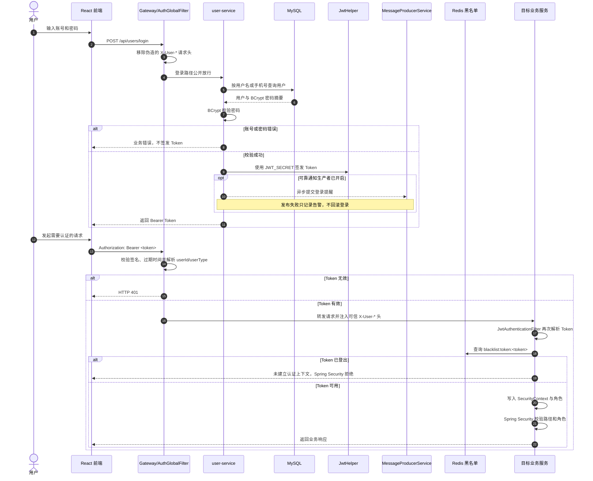
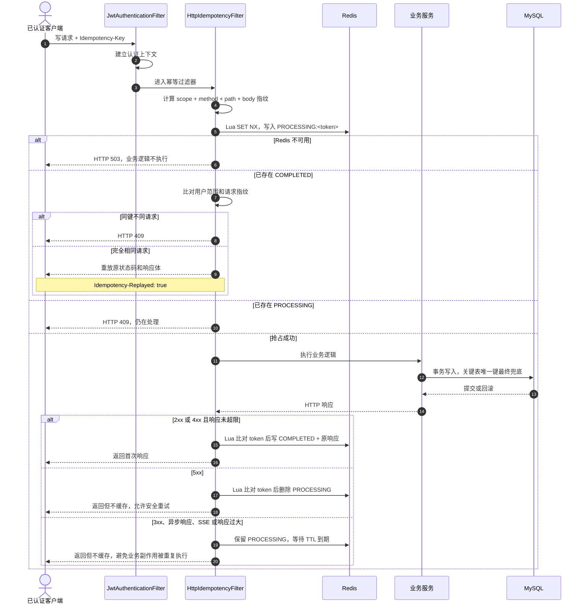
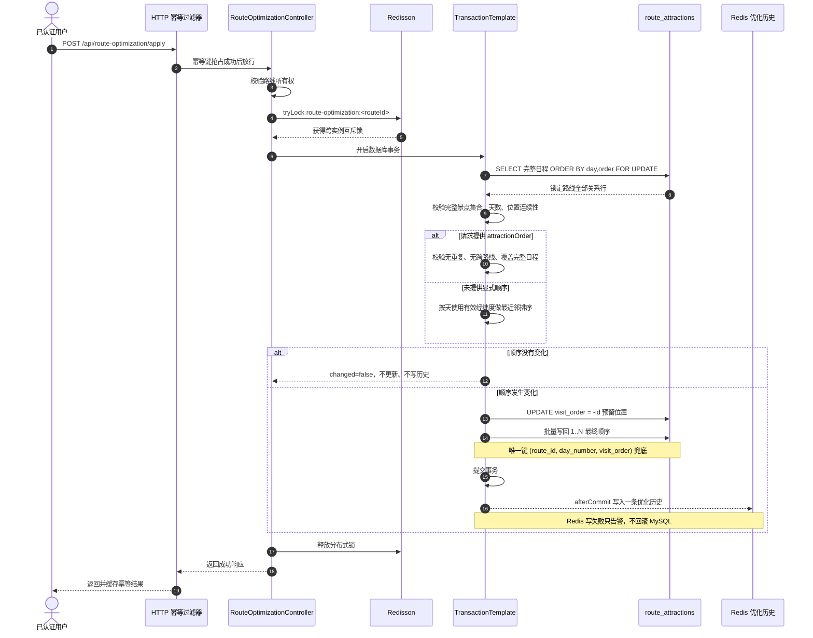
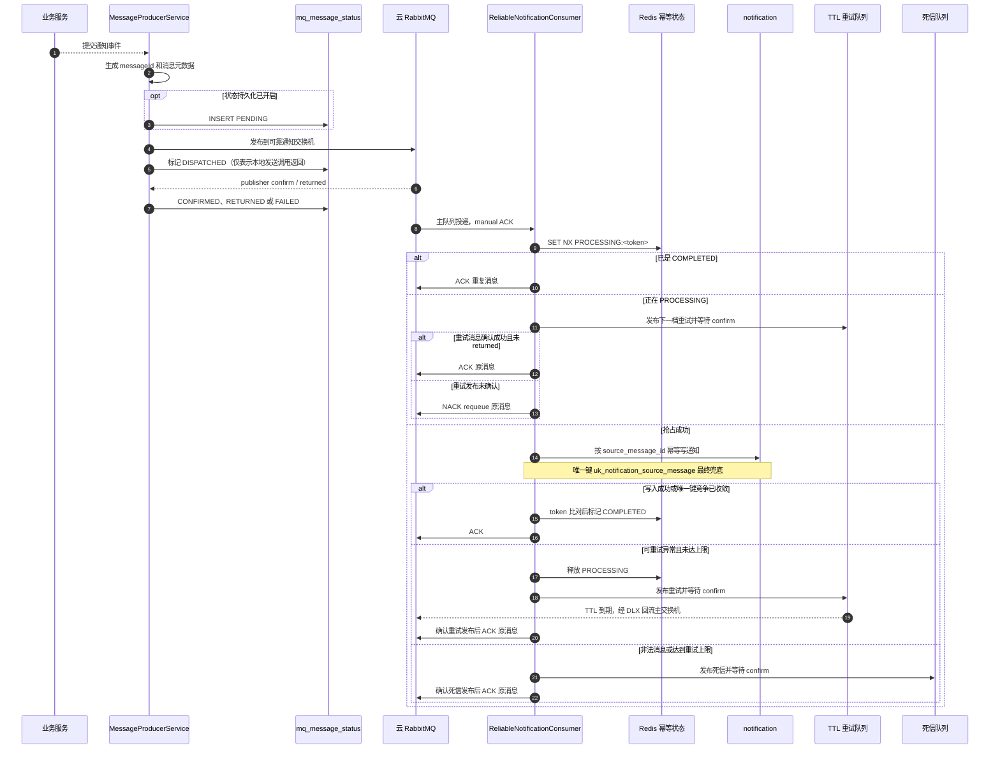

# 核心链路时序图

本文只描述当前代码中已经接线的真实链路，类名、状态和失败语义均可在源码或测试中核对。项目不使用 Milvus；高德、通义千问、百度 AI 和云 RabbitMQ 都属于外部条件能力。

## 1. JWT 登录与鉴权

### 设计要点

- Gateway 会先删除客户端提交的 `X-User-Id`、`X-User-Type`、`X-User-Role` 和 `X-Client-IP`，再写入可信值，避免请求头伪造。
- 业务服务仍通过 `JwtAuthenticationFilter` 建立 `SecurityContext`，并检查 Redis Token 黑名单；Gateway 与服务内鉴权形成两层防线。
- `JWT_SECRET` 为空或不足 32 个 UTF-8 字节时，Gateway 拒绝启动。
- 登录通知是旁路能力，RabbitMQ 故障不能影响登录主事务。

## 2. HTTP 幂等状态机

### 设计要点

- 仅处理已认证的 `POST`、`PUT`、`PATCH`、`DELETE`；未携带幂等键的请求保持原语义。
- Redis 键按“认证主体 + 幂等键”做 SHA-256，处理中 TTL 默认 300 秒，完成态 TTL 默认 3 天。
- 请求指纹包含方法、完整路径、内容类型和请求体，防止同一键被用于不同业务请求。
- Redis 故障采用 fail-closed：返回 HTTP 503，不绕过幂等保护写数据库。
- `multipart/*`、SSE、超过 1 MiB 的请求或响应不进入响应复用流程；数据库唯一键仍是关键业务的最终防线。
- 只有明确的 5xx 失败会释放处理中锁；非 5xx 但无法复用响应时保留锁到 TTL，避免业务已成功却被重复执行。

## 3. 路线优化并发一致性

### 设计要点

- Redisson 锁解决多实例并发，`SELECT ... FOR UPDATE` 解决事务级并发，数据库唯一键负责最终约束。
- 先写 `-id` 再写最终正序，消除两个景点互换位置时的临时唯一键冲突。
- 无变化请求不会重复更新，也不会重复写优化历史；100 个不同幂等键并发时仍只产生一次实际变更。
- 当前 `apply` 入口的自动排序是“按天、基于本地经纬度的最近邻顺序”；`optimizationType` 目前用于参数归一化和历史标识，不代表已经实现独立的时间、费用多目标求解器。

## 4. RabbitMQ 可靠通知与最终一致性

### 设计要点

- 可靠通知拓扑、生产者、消费者和状态持久化均由独立开关控制，默认关闭；当前部署连接外部云 RabbitMQ，不在 Compose 中启动本地 broker。
- publisher confirm 与 mandatory returned callback 区分“到达交换机”和“无法路由”；`DISPATCHED` 不能被解释为消费成功。
- 三档 TTL 重试为 5 秒、30 秒、120 秒，不依赖 RabbitMQ 延迟插件；超过上限或载荷非法进入 DLQ。
- 只有目标重试/死信消息获得 broker confirm 且未 returned 后，消费者才 ACK 原消息，避免转发窗口丢消息。
- `mq_message_status` 已具备状态记录和补偿抢占原语，但当前没有接线中的定时补偿扫描任务，不能对外宣称“消息表自动定时重投”。

## 5. 代码入口

| 链路 | 主要实现 |
|------|----------|
| 认证 | `gateway/.../AuthGlobalFilter.java`、`common/.../JwtAuthenticationFilter.java`、`user-service/.../UserServiceImpl.java` |
| HTTP 幂等 | `common/.../HttpIdempotencyFilter.java`、`common/.../HttpIdempotencyService.java` |
| 路线优化 | `route-service/.../RouteOptimizationServiceImpl.java`、`RouteAttractionServiceImpl.java` |
| RabbitMQ | `common/.../MessageProducerService.java`、`ReliableNotificationRabbitConfig.java`、`collection-service/.../ReliableNotificationConsumer.java` |

测试和压测证据见 [EVIDENCE_INDEX.md](EVIDENCE_INDEX.md)。
